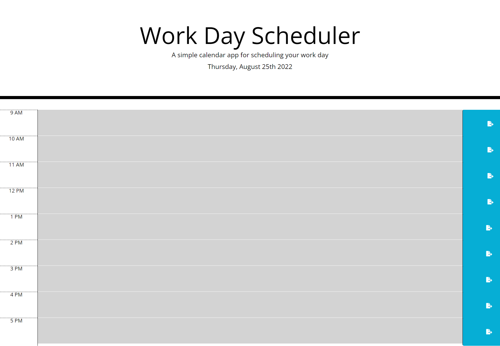

# Name
Work Day Scheduler

## Description
This is a simple calendar application that allows a user to save events for each hour of the work day (9 am - 5 pm).

### Screenshot of My Project

#### Link to My Project
<a href="https://jrettinger.github.io/password-generator/" target= blank>Link to my project</a>